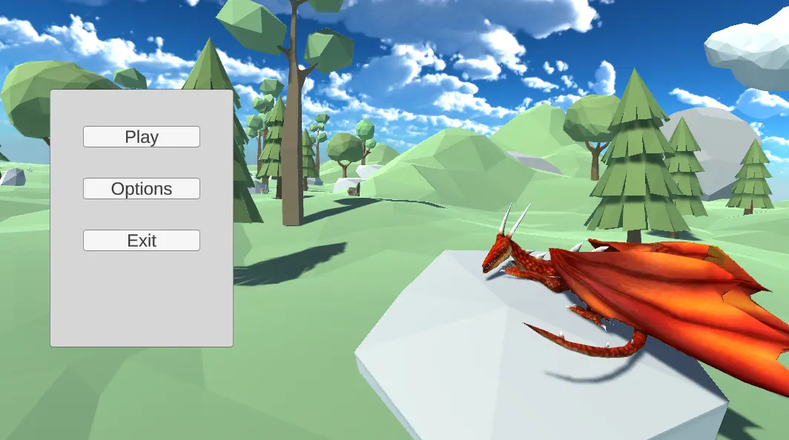
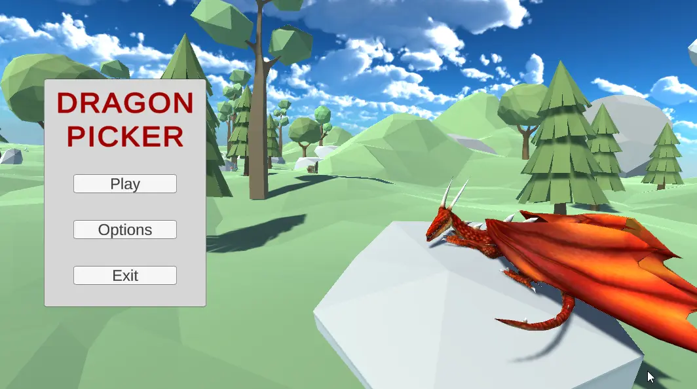
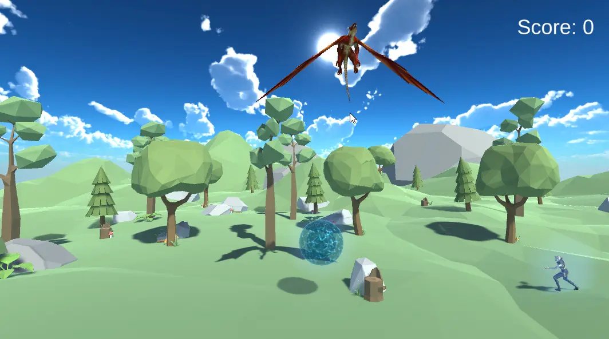

# РАЗРАБОТКА ИГРОВЫХ СЕРВИСОВ
### Ссылка на проект: https://github.com/A-Zaikin/DragonPicker
Отчет по лабораторной работе #4 выполнил:
- Заикин Александр Юрьевич
- РИ300012
Отметка о выполнении заданий (заполняется студентом):

| Задание | Выполнение | Баллы |
| ------ | ------ | ------ |
| Задание 1 | * | 60 |
| Задание 2 | * | 20 |
| Задание 3 | * | 20 |

знак "*" - задание выполнено; знак "#" - задание не выполнено;

Работу проверили:
- к.т.н., доцент Денисов Д.В.
- к.э.н., доцент Панов М.А.
- ст. преп., Фадеев В.О.

## Цель работы
Интеграция интерфейса пользователя в разрабатываемое интерактивное приложение.

## Задание 1
### Используя видео-материалы практических работ 1-5 повторить реализацию функционала
Ход работы:
#### Работа 1: «Создание анимации объектов на сцене»
1) Скопировать основную сцену и назвать её MainMenuScene.
2) Удалить ненужные геймплейные объекты и компоненты.
3) Добавить дракону новую анимацию Sleep.
4) Переместить дракона и камеру на сцене.
5) Импортировать префаб облака.
6) Создать и добавить облаку clip анимации движения и небольшого поворота. Поставить анимации цикл.


#### Работа 2: «Создание стартовой сцены и переключение между ними»
1) Создать скрипт MainMenu:
```cs
using UnityEngine;
using UnityEngine.SceneManagement;

public class MainMenu : MonoBehaviour
{
    public void PlayGame()
    {
        SceneManager.LoadScene("MainScene");
    }

    public void ExitGame()
    {
        Application.Quit();
    }
}
```
2) Создать UI панель с кнопками, подключить их к созданному скрипту.



#### Работа 3: «Доработка меню и функционала с остановкой игры»
1) Добавить Title.
2) Добавить панель настроек и переключение на неё.
3) Добавить панель с паузой на сцену с геймплеем.
4) Добавить паузу на нажатие пробела и выход в меню на нажатие Escape.



#### Работа 4: «Добавление звукового сопровождения в игре»
1) Импортировать звуковые эффекты и музыку.
2) Добавить в объекты AudioSource и в них ссылки на AudioClip.

https://user-images.githubusercontent.com/82456483/198248135-28ad1b9b-ec37-4896-b8a0-7dd5ce27ae54.mp4

#### Работа 5: «Добавление персонажа и сборка сцены для публикации на web-ресурсе»
1) Скачать и импортировать модель персонажа и анимации с mixamo.com.
2) Добавить на сцену префаб мага и настроить AnimationController.
3) Добавить на сцену источники света.
4) Провести сборку приложения.



## Задание 2
### Привести описание того, как происходит сборка проекта проекта под другие платформы. Какие могут быть особенности?
Ход работы:
1) Изменить настройки билда для выбранной платформы -> сделать билд.
2) Устройства ввода могут различаться на разных платформах. Для решения проблемы можно добавить уровень абстракции между кодом для обработки ввода и игровой логикой.
3) На некоторых платформах существуют специальные устройства ввода (акселерометр, GPS, гироскоп). В приложение можно добавить их поддержку.
4) На мобильных устройствах существуют ограничения по памяти и производительности. Возможно, нужно будет провести оптимизацию приложения и размера ассетов на диске.
5) Существуют директивы в коде, которые позволяют исполнять разный код на разных платформах.
```cs
#if UNITY_IOS
    Debug.Log("iOS");
#endif

#if UNITY_STANDALONE_OSX
    Debug.Log("Standalone OSX");
#endif

#if UNITY_STANDALONE_WIN
    Debug.Log("Standalone Windows");
#endif
```

## Задание 3
### Добавить в меню Option возможность изменения громкости (от 0 до 100%) фоновой музыки в игре
Ход работы:
1) Добавить в меню настроек новый UI элемент - слайдер.
2) Добавить в MusicManager новый скрипт:
```cs
using UnityEngine;
using UnityEngine.UI;

public class VolumeLoader : MonoBehaviour
{
    [SerializeField] private string settingsName;
    [SerializeField] private Slider menuSlider;

    private AudioSource audioSource;

    public void SaveVolume(float volume)
    {
        audioSource.volume = volume;
        PlayerPrefs.SetFloat(settingsName, volume);
        PlayerPrefs.Save();
    }

    private void Awake()
    {
        audioSource = GetComponent<AudioSource>();
        if (!PlayerPrefs.HasKey(settingsName))
        {
            return;
        }

        var volume = PlayerPrefs.GetFloat(settingsName);
        audioSource.volume = volume;
        if (menuSlider != null)
        {
            menuSlider.value = volume;
        }
    }
}
```
3) On WebGL, Unity stores up to 1MB of PlayerPrefs data using the browser's IndexedDB API.


https://user-images.githubusercontent.com/82456483/198527447-7be8993e-d4c2-4055-adae-68f1004eda3e.mp4


## Выводы

Изучены:
- импортирование моделей и анимаций,
- создание нескольких сцен и переключение между ними,
- создание базового меню,
- добавление звукового сопровождения и настроек громкости.

## Powered by

**BigDigital Team: Denisov | Fadeev | Panov**
